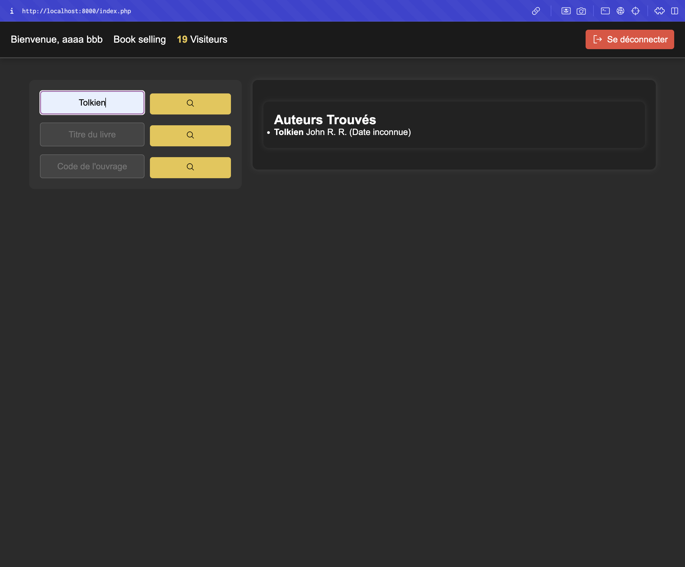

# 📚 Vente de Livres - Web Back-End

This project is developed as part of the **Web Back-End** course at **ENSICAEN** .  
The website allows users to **search for authors, books, and book codes** in a **PostgreSQL database**. It also includes user login/logout functionality and a **visitor counter**.

---

## 🛠️ **Project Setup & Configuration**

### 📌 **1. Prerequisites**
Before running the project, make sure you have installed:

- [PHP](https://www.php.net/)
- [PostgreSQL](https://www.postgresql.org/)

---

## 🏰 **Database Configuration**
This project was run locally, if you would like to also run locally follow the next steps.
### 📌 **2. Start PostgreSQL**


The PostgreSQL used was installed via **Homebrew** on macOS, start the service with:
```sh
brew services start postgresql
```
To check if the database is running:
```sh
psql -U $USER -l
```
This will list all available databases.

### 📌 **3. Create the Database**
If the **livres_db** database does not exist, create it manually:
```sh
createdb -U $USER livres_db
```
Now, import the SQL dump file:
```sh
psql -U $USER -d livres_db -f ~/path/to/dump-livres.sql
```
To verify if the import was successful:
```sh
psql -U $USER -d livres_db -c "\dt"
```
This will list the imported tables.

---

## 🚀 **Running the Project**

### 📌 **4. Configure the Database in the Project**
Edit the **config.php** file and define the database credentials:

```php
<?php
$host = "localhost";
$dbname = "livres_db"; // Database name
$user = "your_postgres_user"; // Replace with your PostgreSQL username
$password = "";        // If you have password, add it here

try {
    $pdo = new PDO("pgsql:host=$host;dbname=$dbname", $user, $password, [
        PDO::ATTR_ERRMODE => PDO::ERRMODE_EXCEPTION
    ]);
} catch (PDOException $e) {
    die("Error connecting to the database: " . $e->getMessage());
}
?>
```

### 📌 **5. Start the Local Server**
Run the following command inside the project directory:
```sh
php -S localhost:8000
```
Now, open your browser and go to:
```sh
http://localhost:8000/
```

---

## 🔍 **Testing the Features**

### 📌 **6. Search & Data Retrieval**
Users can perform **book and author searches** on **index.php** using:

- **Search Author** (by surname, first name, or code)
- **Search Book** (by title)
- **Search Book by Code** (by book code)

Each search sends an AJAX request to **requete.php**, which queries the PostgreSQL database.

#### **🖥️ Example Requests:**
You can test the requests directly using:
```sh
http://localhost:8000/requete.php?search_author=John
http://localhost:8000/requete.php?search_title=Les%20chants
http://localhost:8000/requete.php?search_title_code=144
```

Se no parameters are provided, **requete.php** will return an empty response.

---

## 🖼️ **Screenshots**


---

## 🛠️ **File Structure**
The project is structured as follows:

```
📂 project-root
 ┣ 📜 index.php       # Main page with search functionality
 ┣ 📜 login.php       # User login page
 ┣ 📜 logout.php      # Ends session and redirects to login
 ┣ 📜 requete.php     # Handles database queries for search
 ┣ 📜 config.php      # Database connection setup
 ┣ 📜 styles.css      # Styling for the website
 ┣ 📜 compteur.txt    # Stores the visitor count
 ┗ 📜 README.md       # Documentation (this file)
```

---

## 📊 **Visitor Counter**
A **visitor counter** is implemented using a cookie-based tracking system.

### 📌 **How it Works**
- The counter value is stored in `compteur.txt`.
- Each unique visitor increments the counter.
- A cookie (`visited`) prevents multiple counts within **one hour**.
- The counter is displayed in the navbar as:
  ```
  <li class="visitors"><b><?php echo $counter; ?></b> Visiteurs</li>
  ```

**Code Implementation in `index.php`:**
```php
function incrementCounter() {
    $counterFile = "compteur.txt";
    if (!file_exists($counterFile)) {
        file_put_contents($counterFile, 0);
    }

    if (!isset($_COOKIE['visited'])) {
        $counter = (int) file_get_contents($counterFile);
        $counter++;
        file_put_contents($counterFile, $counter);
        setcookie("visited", "true", time() + 3600); // 1 hour 
    } else {
        $counter = (int) file_get_contents($counterFile);
    }
    return $counter;
}
```

---

## 🎨 **User Interface Enhancements**
Inspired by the image from the TP1 I decided to do some **UI work** in this project:
- **Navbar with logout button and visitor counter**
- **Search buttons with search icons (`<i class="ph ph-magnifying-glass"></i>`)**
- **Styled logout button with an icon:**
```html
<a href="logout.php" class="logout-btn">
    <i class="ph ph-sign-out"></i> Se déconnecter
</a>
```

---

## 🛡️ **Future Improvements**
- [ ] Make the **result table styling** to show full information after the request.

---

## 📜 **Project Contributors**
**Luciana Adrião** for the CyberIA major. 
for the **Web Back-End** course at **ENSICAEN**.
